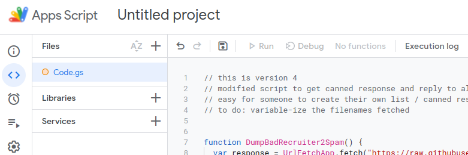
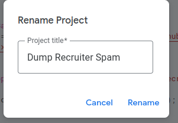
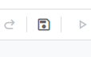

# How to Install A Copy of the Script

https://script.google.com/d/1HO7qKjxYjrOvyfPm6F_mnoItWXHVXxCvFdd24sCCCr5Di7qMqrEQEMIA/edit?usp=sharing
## Prerequisites
This Google Apps Script only works with Google's GMail accounts.  If you don't use Gmail, this script will do nothing for you.

## Implementation

1. Navigate to the following link from your browser:  [Google App Scripts Home](https://script.google.com/home)  
2. Click the New Project button  
3. Open a second tab on your browser and navigate to the [FilterBadRecruiters raw JS page](https://raw.githubusercontent.com/lcreed/FilterBadRecruiters/main/FilterBadRecruiters.js) on Github  
4. Copy the entire contents of the raw java script tab onto the clipboard 
5. Switch back to your Apps Script tab and select all the text in the body of the editor
6. Paste the contents of the clipboard into the apps script editor. This should completely replace the previous contents with the new script.  
  
7. Click on the Untitled Project name at the top of the page and give your new project a name before clicking Rename.  
 
8. Click the save project icon.   
  

The script is now implemented in your Google Workspace.  You can modify it anyway you choose including to use your own canned response / filter list or use mine.  When you are ready to test the script, click the Run icon.  The first time you run the script you will be prompted to authorize it to access your Gmail data.  Before authorizing any script, read through it to determine what it will be doing.  For this script, you can review the workflow portion below and match it to the actual javascript.

To authorize,
1. Click Review permissions
2. Choose your Google sign in account
3. Because the copy you pasted isn't verified by Google, you will need to click the advanced link and then the link to Go to your project name.
4. Click Allow

The script will then run and flag as spam any messages from the current domain lists.  You can find these messages in your spam folder.

In order to setup the script to run automatically, you'll need to create a trigger.  

## Create a Trigger to run the script on a schedule

*Note:  Unfortunately I can find no way to trigger the script to run when new mail arrives.  Google also restricts how many times the script can run in specific periods.*  

To prevent issues, my trigger is set to run the script every hour.  To replicate that setup, click the Trigger icon that looks like an alarm clock.  
  
In the lower right corner of the screen, click the Add Trigger button.  The default dialog will appear.  If you want the script to run hourly, simply click the save button.
