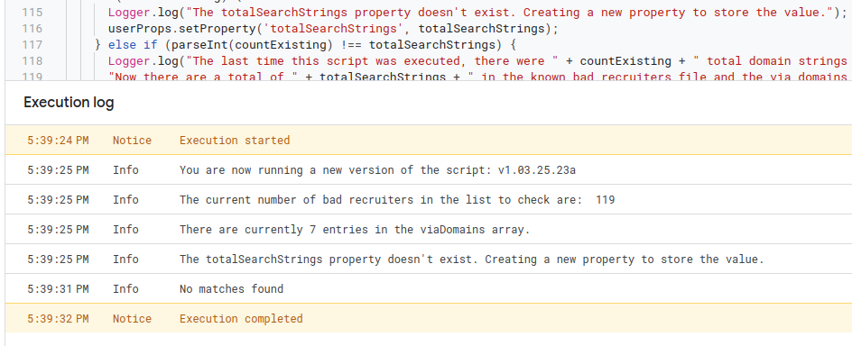

# Setup Public Version Of FilterBadRecruiters Script

This script is delivered as a public library and will function the same way for everyone.  It will utilize the current version's canned response file to reply to third party recruiters on the list or those not on the list using known spam email services.  However, it will create a new spreadsheet in your Google Drive account and email you the URL of the spreadsheet the first time the script finds a match in your email.  This reporting spreadsheet will be unique to your account.

Before proceeding, open the [FilterBadRecruiters-PublicLibrary](https://script.google.com/d/1HO7qKjxYjrOvyfPm6F_mnoItWXHVXxCvFdd24sCCCr5Di7qMqrEQEMIA/edit?usp=sharing) and review the code to verify that none of the data this script will be granted access to is being shared with anyone but you.  The code starts with the processMessages function so start there and read the comments for the commands that you don't understand.

This is expected to be used on demand and not setup with a trigger to run on a schedule.  If you want to have this functionality run automatically, I'd strongly suggest following the procedure to [Setup Your Own Copy of FilterBadRecruiters](./Install_User.md).  

# Authorize the Script 
These steps are only necessary the first time you run the script.

1. Open the [FilterBadRecruiters-PublicLibrary](https://script.google.com/d/1HO7qKjxYjrOvyfPm6F_mnoItWXHVXxCvFdd24sCCCr5Di7qMqrEQEMIA/edit?usp=sharing).
2. Use the dropdown in the menu bar to select the processMessages function. 
3. Click the Run button to the left of the processMessages function.
4. Click the Review Permissions button in the Authorization Required dialog. 
5. Choose your Google account in the Sign In dialog by clicking it.
6. The next dialog box is scary.  It states that Google hasn't verified this app and that the app is requesting access to sensitive info in your Google Account.  This warning is because the script will be accessing your email and Google Drive account.  You should have already reviewed the script to confirm that it is not providing access to your information to anyone but you.  If you are comfortable proceeding, click the Advanced link.  
7. Click the Go to FiltersBadRecruiters-PublicLibrary (unsafe) link.  
8. The final dialog lists what permissions you are providing the library.  The last permission on the list says "Connect to an external service".  This is because the script fetches two different files from this github repository.  Click Allow to complete the authorization process.
9.  You may have to click the Run icon again to run the script.  After it runs, you will see output similar to this in the execution logs if no matches are found.  (The spreadsheet is not created until a match is found).  

