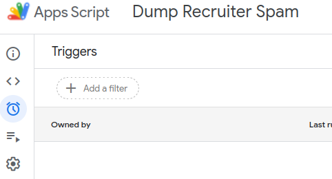

# Install and Configure a Copy of the FilterBadRecruiters Script

This script will function as written without any requirement to update any variables. It will utilize the current version's canned response file to reply to third-party recruiters on the list or those not on the list using known spam email services. It will create a new spreadsheet in your Google Drive account and email you the URL of the spreadsheet the first time the script finds a match in your email. It will also log the URL to its execution output whenever a match is found.  This reporting spreadsheet will be unique to your account.

The variables that can be modified to customize the script are all in the upper two functions in the file.  The getConfigVars() function is what defines the data the code will use to process messages.  The getReportVars() defines how reporting of matches will be done.  Some properties are stored in Google's cloud storage associated with you, the user.  These properties include the last version of the script you ran, the file id associated with your reporting spreadsheet, and the total search string count from the last run of the script.  To review the full code workflow, start with the processMessages function.  

## Install and Authorize the Script

These steps are only necessary the first time you run the script.

1. Type [script.new](https://script.new) and hit enter in your browser search bar.  This should take you to a new Untitled project in the script.google.com site.  
2. In the window with the 4 lines of myFunction code, select all and erase what is there.  Paste the [FilterBadRecruiters script contents](https://raw.githubusercontent.com/lcreed/FilterBadRecruiters/main/FilterBadRecruiters.js) into this field.  
3. Change the name of the Project to FilterBadRecruiters or whatever name you want to call the project and click the Rename button.  
  
4. After reviewing the document outlining [user variables](./userVariables.md), make whatever changes you want to be in place, i.e., changing the URL to point to a different email response file.
5. When your review is complete, click the Save button.
6. Use the dropdown in the menu bar to select the processMessages function. 
7. Click the Run button to the left of the processMessages function.
8. Click the Review Permissions button in the Authorization Required dialog.  
9. Choose your Google account in the Sign In dialog by clicking it.
10. The next dialog box states that Google hasn't verified this app and that the app is requesting access to sensitive info in your Google Account. This warning is because the script will be accessing your email and Google Drive account. You should have already reviewed the script to confirm that it is not providing access to your information to anyone but you. If you are comfortable proceeding, click the Advanced link.
11. Click the Go to link that includes the name you gave your project. 
12. The final dialog lists what permissions you are providing the script. The last permission on the list says "Connect to an external service". This is due to the script performing a urlFetch for two different files from this GitHub repository. Click Allow to complete the authorization process.
13. You may have to click the Run icon again to run the script. After it runs, you will see output similar to this in the execution logs if no matches are found. (The spreadsheet is not created until a match is found).  

## Create a Trigger to run the script on a schedule

My Trigger configuration executes the script every 15 minutes.  To replicate that setup, click the Trigger icon that looks like an alarm clock.  
  
In the lower right corner of the screen, click the Add Trigger button.  The default  Trigger dialog will appear.  Use the dropdown to choose the processMessages function. If you want the script to run every 15 minutes, model your dialog after this image and click Save:  
